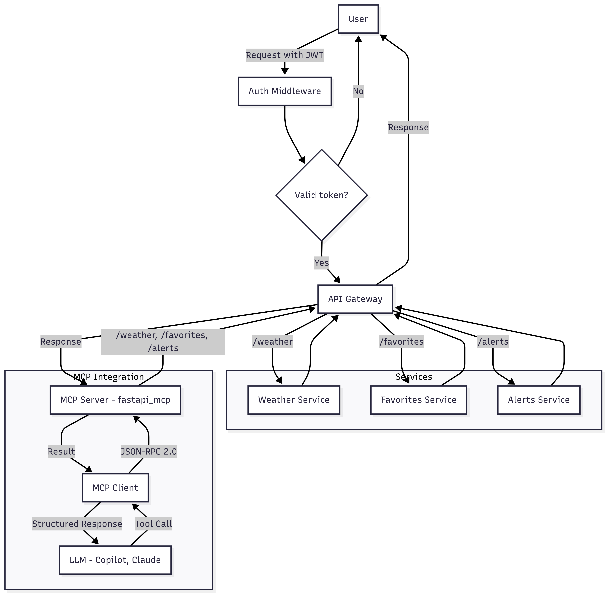

# Weather Gateway API (MCP-Enabled)

This project is a FastAPI-based Weather Gateway that exposes weather forecast endpoints by city name or geographic coordinates. It is fully integrated with the **Model Context Protocol (MCP)**, enabling interaction with **LLMs (Large Language Models)** and AI agents that support structured tool calling.

## What is MCP?

MCP (Model Context Protocol) is the emerging standard that defines how AI models and agents can securely and dynamically communicate with external applications via structured API calls. By supporting MCP, this API can now be called by LLMs (like OpenAI’s GPT) to retrieve real-time weather information.

## Authentication

All endpoints in the API Gateway require both authentication and authorization.
Users must register and log in via OAuth2 to obtain a JWT token, which must be included in the Authorization header of each request using the Bearer scheme. This token authenticates the user and also carries permission data used to authorize access to protected endpoints—such as retrieving weather data, managing favorite cities, and checking weather alerts.


## Architecture diagram



## Project Structure

- **gateway/**: API Gateway built with FastAPI, routes requests to the appropriate services.
- **weather_service/**: Provides weather data for a given city.
- **favorites_service/**: Allows users to add and list favorite cities.
- **alerts_service/**: Returns weather alerts.

## Requirements

- Python 3.10+
- [FastAPI](https://fastapi.tiangolo.com/)
- [httpx](https://www.python-httpx.org/)
- [uvicorn](https://www.uvicorn.org/)
- [fastapi_mcp](https://github.com/tadata-org/fastapi_mcp)

## Installation

1. Clone the repository:

2. Install dependencies using [uv](https://github.com/tonybaloney/uv):

```bash
pip install git+https://github.com/tonybaloney/uv.git
uv install
```

## Running the Services

Start each service in a separate terminal:

**Weather Service**
```bash
cd weather_service
uvicorn main:app --reload --host 0.0.0.0 --port 8001
```

**Favorites Service**
```bash
cd favorites_service
uvicorn main:app --reload --host 0.0.0.0 --port 8002
```

**Alerts Service**
```bash
cd alerts_service
uvicorn main:app --reload --host 0.0.0.0 --port 8003
```

**API Gateway**
```bash
cd gateway
uvicorn main:app --reload --host 0.0.0.0 --port 8000
```
### Building Docker Images

To build all the required Docker images for the environment, use the script:

```bash
./build-images.sh
```

This script will build all images defined in the project, ensuring they are up to date for use with Docker Compose.

### Running Docker Compose

After building the images, start all services with:

```bash
docker-compose up
```

To run in detached mode (in the background):

```bash
docker-compose up -d
```

This will start all containers defined in the `docker-compose.yml` file, using the newly built images.

---
## API Endpoints

- `GET /api/weather?city=CityName` — Get weather for a city.

- `POST /api/favorites/add` — Add a city to the authenticated user's favorites.  
  JSON body:  
  ```json
  { "city": "CityName" }
  ```
  The `user` field is automatically filled by the gateway using the JWT token.

- `GET /api/favorites/list` — List favorite cities for the authenticated user.

- `GET /api/alerts/check` — Get weather alerts for all favorite cities of the authenticated user.  
  Returns a JSON object where each key is a favorite city and the value is a list of alerts, for example:
  ```json
  {
    "Fortaleza": ["High probability of rain in the next few hours."],
    "Recife": []
  }
  ```